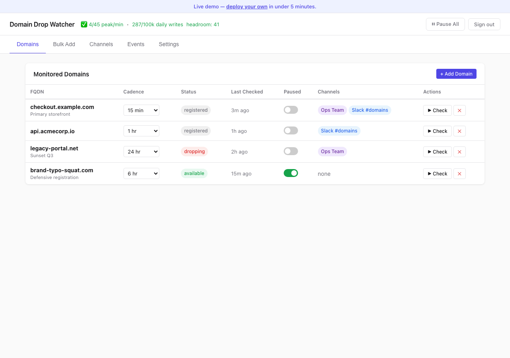

# Domain Drop Watcher

<!-- dash-content-start -->

Watch domains for drop/release events and get alerted the moment they become available. Multi-user dashboard with magic-link + passkey auth, runs on Cloudflare Workers free tier.

**Bindings used:** D1 (storage), KV (event log), Email Routing (magic-link), Cron Triggers (RDAP polling).

Originally created by Ray Orsini at [OIT, LLC](https://oit.co). Source, issues, and updates: [https://github.com/oitray/domain-drop-watcher](https://github.com/oitray/domain-drop-watcher) (synced from v0.2.0). Live demo: [ddw.oitlabs.com](https://ddw.oitlabs.com).

<!-- dash-content-end -->

## Setup

After deploying via the button above:

1. The first dashboard visit prompts you to register a passkey using the bootstrap admin token (printed in the deploy logs).
2. Configure your alert sender email at Settings → Config → Email Sender.
3. Add domains to monitor at Domains → Add.
4. Wire alert channels (webhook, email) at Channels.

See [https://github.com/oitray/domain-drop-watcher/blob/main/README.md](https://github.com/oitray/domain-drop-watcher/blob/main/README.md) for full configuration docs.
